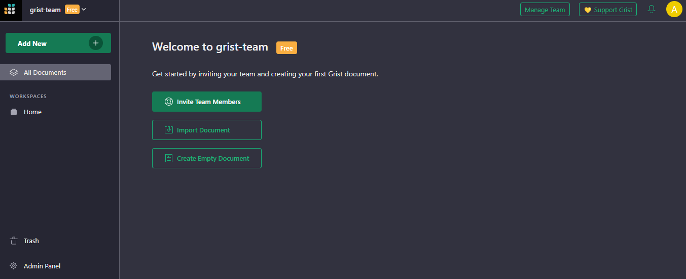

# Grist CI/CD pipeline

Deploy Grist server with CI/CD on Elestio

 
 

# Once deployed ...

You can open Grist here:

    URL: https://[CI_CD_DOMAIN]
    email: [ADMIN_EMAIL]
    password: [ADMIN_PASSWORD]

# User Management Guide

This guide provides instructions on how to add new users to the application by configuring environment variables in Docker Compose and updating the user list in the Grist UI.

## Adding New Users

To add new users, follow these steps:

### Step 1: Update Docker Compose Environment Variables

1.  Log in to your Elestio Dashboard.
2.  Click on the `Update config` button.
3.  Locate the section with the following environment variables:

        EMAIL: ${ADMIN_EMAIL}
        PASSWORD: ${ADMIN_PASSWORD}

4.  Add new environment variables for each additional user. For example, to add a new user with the email `new@user.com` and password `password`, you would add:

        EMAIL2: new@user.com
        PASSWORD2: password

5.  Increment the `EMAIL` and `PASSWORD` keys for each additional user as needed. For example:

        EMAIL3: another@user.com
        PASSWORD3: anotherpassword

6.  Once done, click on `Update & Restart`.

### Step 2: Add Users to Grist UI

1. Log in to the Grist UI.
2. Click on your team name located in the top left corner.
3. Click on `Manage Team`.
4. Add the email address of the new user to the team.

By following these steps, you'll be able to successfully add new users to your application.
